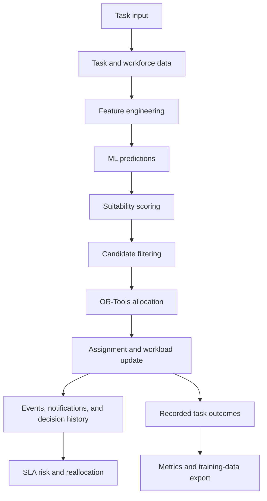
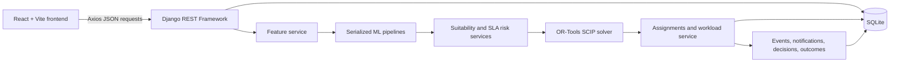
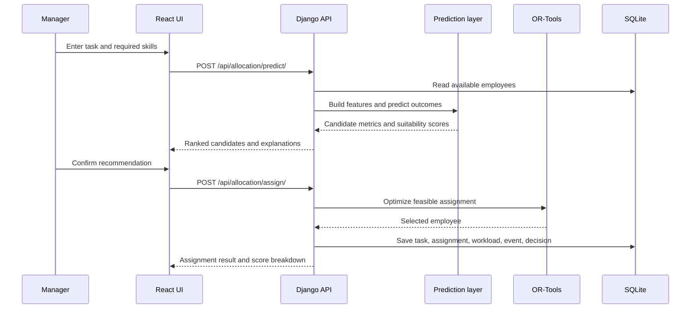
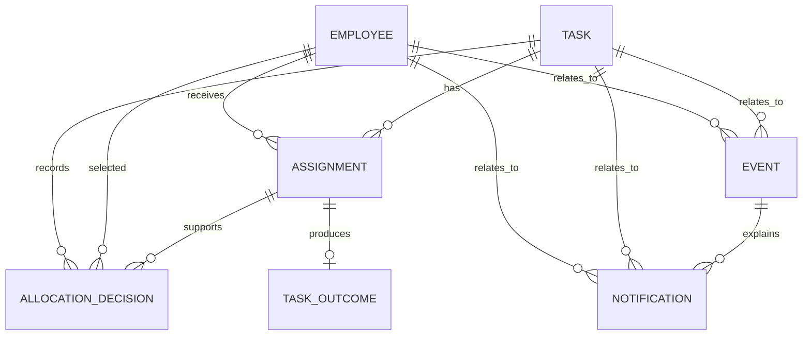

# WorkForceAI
### AI Workforce Decision & Resource Allocation Agent

**Live demo:** https://workforceai.onrender.com/
**Backend:** https://workforceai-backend.onrender.com/
**GitHub:** https://github.com/Balarithik/WorkForceAI

> WorkForceAI helps a manager allocate work by combining employee skills, availability, workload, historical performance, task urgency, SLA information, machine-learning predictions, and constraint-based optimization in one decision workflow.

## Problem Statement

Organizations often have more work than immediately available people. A manual or first-available assignment can select someone with the wrong skills, overload an employee, ignore an approaching SLA, or create extra reassignment work when availability changes.

The engineering challenge is to allocate competing tasks while considering the workforce state at the time of the decision: skills, capacity, availability, location, experience, historical performance, estimated effort, task priority, and SLA timing. WorkForceAI addresses this as a decision-support problem rather than a simple CRUD employee directory.

## Proposed Solution

WorkForceAI turns a task request into ranked, explainable candidates and a feasible assignment. The machine-learning layer estimates likely outcomes; the allocation layer then applies operational constraints before an assignment is created.



The current repository stores outcomes and exports them for analysis; it does not contain an automatic model-retraining job. The frontend presents the workflow through a React interface, while Django REST Framework owns validation, persistence, prediction, allocation, and event handling.

## Project Workflow

1. A manager enters a task title, priority, effort estimate, SLA, and required skills.
2. The backend validates the task and reads available employees from SQLite.
3. Feature engineering derives skill match, capacity, workload, location, experience, performance, and urgency features.
4. Three serialized pipelines predict task success probability, SLA probability, and completion time.
5. Candidates are filtered by availability, minimum skill match, workload capacity, and predicted completion against the task SLA.
6. A suitability score ranks the remaining candidates.
7. OR-Tools selects a feasible candidate assignment using the suitability score as its objective.
8. The assignment is persisted, the task status becomes `ASSIGNED`, and employee workload is recalculated.
9. The system records an event and an allocation decision with the score breakdown and reason.
10. SLA risk is derived from the SLA prediction; high or critical risk creates a notification.
11. If an assigned employee becomes unavailable, active assignments are marked `REALLOCATED` and the task is evaluated again against available employees.
12. Actual outcomes can be stored against assignments and exported as CSV for later analysis.

## Key Features

### Intelligent workforce allocation

Task creation first produces a ranked candidate comparison, then confirmation creates an assignment through the same prediction and optimization path. A manager may request a particular employee, but the backend still validates availability and feasibility.

### Skill- and capacity-aware matching

The feature pipeline compares required task skills with employee skills and calculates available capacity from workload. Employees must be available and meet the configured `MIN_SKILL_MATCH`; estimated effort must fit the remaining workload capacity.

### SLA-aware prediction and risk

The SLA pipeline returns an SLA probability and the completion pipeline predicts hours. Risk is calculated as `1 - SLA probability` and classified as `LOW`, `MEDIUM`, `HIGH`, or `CRITICAL` using configurable thresholds. This is a prediction-derived risk signal, not a claim that the task has already missed its SLA.

### Explainable recommendations

The API returns a structured explanation containing a summary, reasons, strengths, and risks. The UI shows skill match, workload, capacity, success probability, SLA probability, completion time, time score, and score contributions.

### Workload updates

Active assignment effort is converted to workload percentage using the configured work-period hours. Assignment creation, completion, cancellation, and reallocation recalculate the affected employee and can create `WORKLOAD_CHANGED` events.

### Reallocation

When an employee changes from available to unavailable, active assignments are marked `REALLOCATED`, an unavailability event is recorded, and the reallocation service uses the ML and OR-Tools flow to find a replacement when possible.

### Events and notifications

The backend stores workforce events such as task creation, employee unavailability, workload changes, reallocation, task completion, and SLA risk. Notifications support unread filtering and read/read-all actions. The frontend polls unread notifications every 15 seconds while the backend is ready and provides an Events page with filters.

### Decision history and outcomes

Each confirmed assignment records probabilities, predicted completion, skill match, workload, capacity, suitability, rank, score breakdown, trigger type, and a textual reason. Assignment outcomes store predicted values alongside actual completion time, SLA result, and success result. The API also calculates prediction metrics and exports completed outcomes to CSV.

### Workforce dashboard

The dashboard displays employee totals, availability, active and critical tasks, average workload, task status, SLA risks, and current assignments. Separate screens expose employees, tasks, assignments, events, SLA risk, and decision replay.

## Innovations Added

1. **Prediction separated from decision-making.** ML estimates candidate outcomes, while OR-Tools chooses an assignment that satisfies operational constraints.
2. **Explainable allocation.** The recommendation contains a human-readable reason and a numerical breakdown of success, SLA, and time contributions.
3. **SLA risk visibility.** SLA probability is transformed into a configurable risk level shown through the API and UI.
4. **Event-driven reassessment.** Employee unavailability changes the assignment state and invokes a replacement-allocation path.
5. **Decision replay data.** Allocation decisions preserve the context needed to inspect why an employee was selected and how a task changed over time.
6. **Outcome feedback infrastructure.** Actual assignment outcomes, prediction metrics, and training-data export are implemented, but automated retraining is outside the current repository.

## System Architecture



- **Frontend:** React Router defines the user-facing workflow; Axios calls the backend API using `VITE_API_BASE_URL`.
- **API:** Django and Django REST Framework validate requests, expose model-backed endpoints, and coordinate services.
- **Persistence:** SQLite stores workforce, task, assignment, event, notification, decision, and outcome records.
- **AI layer:** `MLService` loads the three tracked `.pkl` pipelines with `joblib` from `backend/ml_models/`.
- **Optimization layer:** `AllocationService` uses OR-Tools' SCIP linear solver with Boolean assignment variables.
- **Operational layer:** Workload, reallocation, explanation, risk, notification, decision, and outcome services persist the effects of allocation decisions.

## AI, Machine Learning & Optimization

### Model artifacts

The tracked files are:

| File | Purpose in the application | Runtime output |
|---|---|---|
| `backend/ml_models/task_success_model.pkl` | Estimate task success likelihood | `success_probability` from `predict_proba` |
| `backend/ml_models/sla_model.pkl` | Estimate likelihood of meeting the SLA | `sla_probability` from `predict_proba` |
| `backend/ml_models/completion_time_model.pkl` | Estimate delivery duration | `predicted_completion_hours` from `predict` |

Each artifact is loaded as a scikit-learn `Pipeline`. Inspection of the serialized objects shows a `ColumnTransformer` with `StandardScaler` for numeric columns and `OneHotEncoder(handle_unknown='ignore')` for task type and priority, followed by an XGBoost estimator. The first two pipelines contain `XGBClassifier`; the completion pipeline contains `XGBRegressor`.

### Feature engineering

`extract_features` derives the following inference features:

- normalized task type and priority
- employee experience and historical performance
- required-skill match percentage and required-skill count
- current workload and workload capacity
- employee availability and availability score
- employee and task location, distance, and location compatibility
- similar-task completion count and success rate
- estimated effort, SLA hours, remaining SLA hours
- experience/performance score
- SLA urgency ratio
- workload/effort ratio

The ML frame selects these model columns: `experience_years_x`, `skill_match_score`, `employee_workload_percent`, `historical_performance_score`, `estimated_effort_hours_y`, `sla_hours_y`, `task_type_y`, `task_priority_y`, `workload_capacity`, `sla_urgency_ratio`, `experience_performance_score`, and `workload_effort_ratio`. Employee and task identifiers are not passed to the model frame as predictive columns.

### Suitability scoring

For each eligible candidate, the service calculates:

```text
time_score = min(1.0, sla_hours / max(predicted_completion_hours, 0.1))

suitability_score = 100 * (
    0.50 * success_probability
  + 0.30 * sla_probability
  + 0.20 * time_score
)
```

The result is used for candidate ordering, explanation, decision history, and the optimizer objective.

### OR-Tools allocation

`AllocationService.optimize_allocation` creates a Boolean variable for each valid `(task, employee)` pair and uses the SCIP solver from `ortools.linear_solver.pywraplp`.

- **Objective:** maximize the sum of candidate suitability scores.
- **Task constraint:** each task with valid candidates must receive exactly one selected candidate.
- **Availability constraint:** unavailable employees are excluded from variables.
- **Skill constraint:** candidates below `MIN_SKILL_MATCH` are excluded.
- **SLA feasibility constraint:** candidates whose predicted completion exceeds the task SLA are excluded.
- **Workload constraint:** the sum of assigned task effort for an employee cannot exceed remaining capacity, calculated from `MAX_WORKLOAD_PERCENT` and `HOURS_PER_WORKDAY`.

ML answers “how suitable may this employee be?” The SCIP optimization model answers “which feasible assignment maximizes suitability under the current constraints?”

## Algorithms Used

| Algorithm or method | Where it is used | Why it exists |
|---|---|---|
| XGBoost classification | Success and SLA serialized pipelines | Produces probabilities for two binary outcome estimates. |
| XGBoost regression | Completion-time serialized pipeline | Predicts expected task duration in hours. |
| Standard scaling | Numeric preprocessing in each pipeline | Normalizes numeric feature ranges before estimation. |
| One-hot encoding | Task type and priority preprocessing | Represents categorical task values for the models. |
| Skill-match heuristic | `feature_service.py` | Computes the proportion of required skills present in an employee profile. |
| Weighted suitability formula | `ml_service.py` | Combines success, SLA, and time signals into a comparable score. |
| Mixed-integer linear optimization | OR-Tools SCIP in `allocation_service.py` | Selects feasible task assignments under capacity and eligibility constraints. |
| Threshold classification | `sla_risk_service.py` | Converts predicted SLA probability into a risk probability and level. |

## Technology Stack

| Layer | Technology | Purpose |
|---|---|---|
| Frontend | React 19, Vite, React Router | Workforce screens and task-assignment workflow |
| UI utilities | Axios, lucide-react, Tailwind/PostCSS packages | API access and interface utilities |
| Backend | Django, Django REST Framework | Application and JSON API |
| Database | SQLite | Local and deployed relational persistence |
| ML runtime | joblib, pandas, NumPy, scikit-learn, XGBoost | Load pipelines, prepare features, and predict outcomes |
| Optimization | Google OR-Tools SCIP | Constraint-aware allocation |
| Server | Gunicorn | WSGI serving for the Python deployment |
| Containerization | Dockerfile | Optional backend image with `/app` as working directory |
| Deployment | Render configuration in `backend/render.yaml` | Python web-service deployment and health checks |

## Data & Decision Pipeline



## Project Structure

```text
WorkForceAI/
├── backend/
│   ├── config/                         Django settings, WSGI, ASGI, and URLs
│   ├── ml_models/                      Three tracked serialized model pipelines
│   ├── workforce/
│   │   ├── management/commands/        Seeding, diagnostics, and test commands
│   │   ├── migrations/                 Database migrations
│   │   ├── services/                   ML, allocation, workload, history, and risk logic
│   │   ├── models.py                   Workforce database models
│   │   ├── serializers.py              REST representations and validation
│   │   ├── urls.py                     API route definitions
│   │   └── views.py                    ViewSets and API operations
│   ├── Dockerfile                      Backend container definition
│   ├── render.yaml                     Render backend service definition
│   ├── .env.example                    Backend environment template
│   ├── manage.py                       Django command entry point
│   └── requirements.txt                Python dependencies
├── frontend/
│   ├── src/components/                 Shared layout and backend status UI
│   ├── src/hooks/                      Backend health polling hook
│   ├── src/pages/                      Dashboard and workflow screens
│   ├── src/api.js                      Axios API client
│   ├── src/App.jsx                     React Router configuration
│   ├── .env.example                    Frontend API URL template
│   ├── nginx.conf                      Static-server configuration
│   └── package.json                    Frontend dependencies and scripts
└── README.md
```

## API Overview

All application routes are under `/api/`.

### Health and dashboard

| Endpoint | Method | Purpose |
|---|---|---|
| `/api/health/` | GET | Reports database, ML model, and OR-Tools readiness. |
| `/api/dashboard/stats/` | GET | Returns workforce and task summary counts. |

### Workforce and tasks

| Endpoint | Methods | Purpose |
|---|---|---|
| `/api/employees/` | GET, POST | List or create employees. |
| `/api/employees/{id}/` | GET, PUT, PATCH, DELETE | Read or update an employee; availability changes can trigger reallocation. |
| `/api/tasks/` | GET, POST | List or create tasks. |
| `/api/tasks/{id}/` | GET, PUT, PATCH, DELETE | Read or update a task. Completing/cancelling a task closes active assignments. |
| `/api/assignments/` | GET, POST | List or create assignments with validation and workload updates. |
| `/api/assignments/{id}/` | GET, PUT, PATCH, DELETE | Manage an assignment. |
| `/api/events/` | GET, POST | List or create workforce events. |
| `/api/events/{id}/` | GET, PUT, PATCH, DELETE | Manage an event. |

### Allocation and risk

| Endpoint | Method | Purpose |
|---|---|---|
| `/api/allocation/predict/` | POST | Returns eligible candidates, ML predictions, suitability scores, SLA risk, and explanations without saving a task. |
| `/api/allocation/assign/` | POST | Creates a task and uses prediction plus OR-Tools to create an assignment. |
| `/api/allocation/reallocate/` | POST | Re-evaluates a task using `{ "task_id": "..." }`. |
| `/api/sla-risks/` | GET | Lists active-task SLA probabilities and risk levels. |

### Notifications, decisions, and outcomes

| Endpoint | Method | Purpose |
|---|---|---|
| `/api/notifications/` | GET | Lists notifications; use `?unread_only=true` to filter. |
| `/api/notifications/{notification_id}/read/` | PATCH | Marks one notification read. |
| `/api/notifications/read-all/` | POST | Marks all unread notifications read. |
| `/api/decisions/` | GET | Lists allocation decisions. |
| `/api/tasks/{task_id}/decision-history/` | GET | Returns decisions for one task. |
| `/api/outcomes/` | GET | Lists recorded task outcomes. |
| `/api/training/export/` | GET | Exports outcome records to `training_data.csv` and returns the path/count. |

## Database & Data Model



- **Employee:** identity, department, skills, experience, workload, availability, location, and historical performance.
- **Task:** title, description, type, required skills, priority, effort, SLA, deadline, location, and status.
- **Assignment:** employee-task relationship, model predictions, suitability, status, and timestamps.
- **Event:** operational activity linked optionally to an employee and task.
- **Notification:** readable event-linked messages with severity and read state.
- **AllocationDecision:** decision context, trigger, rank, score breakdown, reason, and allocation status.
- **TaskOutcome:** predicted values plus actual completion, SLA, and success results for an assignment.

## Local Installation & Running

### Requirements

- Python 3.12 or newer
- Node.js and npm
- SQLite, included with Python

### Clone the repository

```bash
git clone https://github.com/Balarithik/WorkForceAI.git
cd WorkForceAI
```

### Start the backend

Windows PowerShell:

```powershell
cd backend
python -m venv .venv
.venv\Scripts\Activate.ps1
pip install -r requirements.txt
Copy-Item .env.example .env
python manage.py migrate
python manage.py seed_employees
python manage.py seed_data
python manage.py runserver 8000
```

Linux/macOS:

```bash
cd backend
python3 -m venv .venv
source .venv/bin/activate
pip install -r requirements.txt
cp .env.example .env
python manage.py migrate
python manage.py seed_employees
python manage.py seed_data
python manage.py runserver 8000
```

`seed_employees` is an idempotent command that creates or updates `E001` through `E100`. `seed_data` is a development reset command: it clears assignments, tasks, and employees before creating its smaller synthetic dataset. Do not use `seed_data` against production data.

### Start the frontend

Open a second terminal:

```bash
cd frontend
npm install
cp .env.example .env
npm run dev
```

On Windows PowerShell, use `Copy-Item .env.example .env` instead of `cp`. The frontend normally runs at http://localhost:5173 and uses `VITE_API_BASE_URL=http://127.0.0.1:8000/api` from `frontend/.env.example`.

### Useful checks

From `backend/` with the virtual environment active:

```bash
python manage.py check
python manage.py makemigrations --check
python manage.py test
python manage.py system_check_ai
python manage.py test_ml_models
```

From `frontend/`:

```bash
npm run build
npm run lint
```

The three model artifacts must remain at `backend/ml_models/`. The current settings resolve the runtime model directory to `BASE_DIR / "ml_models"`.

## Docker Setup

The repository contains `backend/Dockerfile`. It uses `python:3.13-slim`, sets `/app` as the working directory, installs `backend/requirements.txt`, copies the backend source, runs migrations and static collection, and starts Gunicorn.

Build and run the backend image from the `backend/` directory:

```bash
cd backend
docker build -t workforceai-backend .
docker run --rm -p 8000:8000 workforceai-backend
```

The repository does not contain a `docker-compose.yml`; `docker compose up` is therefore not a supported command from the current tree.

## Deployment

### Render backend

`backend/render.yaml` defines a Render Python web service named `workforceai-backend` with `backend` as its root directory.

- Build: `pip install -r requirements.txt` followed by `python manage.py collectstatic --noinput`
- Start: `gunicorn config.wsgi:application --bind 0.0.0.0:$PORT`
- Health check: `/api/health/`
- Database: SQLite, configured with `SQLITE_DB_PATH`
- Model directory: the current settings resolve it to `BASE_DIR / "ml_models"`, which is `backend/ml_models` for the Render Python service

Render environment variables are represented by `sync: false` entries for `ALLOWED_HOSTS`, `CORS_ALLOWED_ORIGINS`, and `CSRF_TRUSTED_ORIGINS`, plus generated `SECRET_KEY` and the configured database path. In the current settings, `CORS_ALLOW_ALL_ORIGINS=True`; the listed CORS environment variables are present in the Render blueprint but are not read by that settings file. Use the deployed backend URL as the frontend's `VITE_API_BASE_URL` when deploying the frontend.

The repository contains the frontend build configuration and Nginx configuration, but no separate frontend Render service definition. The currently deployed demo is available at https://workforceai.onrender.com/.

### Live endpoints

- Demo: https://workforceai.onrender.com/
- Backend API root: https://workforceai-backend.onrender.com/api/
- Backend health: https://workforceai-backend.onrender.com/api/health/

## Hackathon Evaluation Criteria Alignment

| Evaluation Criterion | Evidence in WorkForceAI |
|---|---|
| Meaningful Development Progress | The repository contains a working React workflow, Django API, persisted workforce data, serialized ML models, constraint-based allocation, event handling, reallocation, and deployment configuration. |
| Core Implementation | Task prediction, candidate ranking, assignment, workload recalculation, SLA risk, notifications, decisions, outcomes, and training-data export are implemented in backend services and API views. |
| Code / Architecture | The code separates serializers, views, feature engineering, model loading, allocation, workload, reallocation, explanation, risk, notification, decision, and outcome services. |
| Problem Statement Alignment | The allocation path directly considers skills, availability, workload, effort, SLA feasibility, predicted completion, and employee capacity when assigning work. |
| Development History | Git history records the MVP, feature additions, deployment and health-check changes, ML model-path fixes, and the later 100-employee seed update. |
| README / Documentation | This document explains the verified workflow, algorithms, data model, API surface, local setup, Docker image, Render configuration, limitations, and evaluation evidence. |

## Development History

The available Git history shows a progression from the initial MVP to the current decision system:

- `02a3a52` records the first MVP completion.
- Subsequent feature commits added workforce allocation capabilities and the broader application workflow.
- `5387b9b` and `c11cf3a` mark later feature-completion and merge stages.
- Deployment work added Render configuration, Docker updates, and health-check changes, including commits `4e0c779`, `617c3ad`, `7af996c`, and `538dd76`.
- Settings and model-path work followed in `1a2c09e`, `2f47b08`, and `fd8b74e`.
- The current branch includes `90745a0`, which updates deterministic employee seeding to 100 profiles.

The history is included as repository evidence, not as a claim that every intermediate design remains active in the current code.

## Limitations & Notes

- SQLite is the configured database, including in the Render service definition. It is simple for this project but is not presented as a horizontally scaled production datastore.
- The serialized model files are required at runtime; there is no fallback mock model when loading fails.
- The repository contains outcome recording, metrics, and CSV export, but no automatic retraining pipeline.
- Reallocation is implemented for employee unavailability and through the explicit reallocation endpoint. The system does not run a background scheduler for continuous reassessment.
- The frontend polls unread notifications every 15 seconds after the backend health check succeeds; this is polling rather than a websocket feed.

## Future Scope

Future work could include a production database, authenticated multi-user access, scheduled reassessment, automatic retraining with validated outcome data, richer task-outcome entry in the UI, and a separately deployed frontend configuration. These are not presented as current capabilities.

## Why WorkForceAI

WorkForceAI turns workforce allocation into a traceable decision pipeline. It combines machine-learning predictions with skill matching, employee availability, workload capacity, SLA feasibility, and an explicit optimization objective instead of treating assignment as a first-available lookup.

The result is a system where a manager can compare candidates, see why a recommendation was made, confirm a feasible assignment, monitor SLA risk, inspect events and decision history, and reallocate work when workforce conditions change. That directly connects the implementation to the operational challenge of assigning the right available person to the right task under changing constraints.
