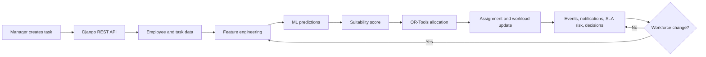

# WorkForceAI

### AI Workforce Decision & Resource Allocation Agent

[Live Demo](YOUR_DEPLOYED_FRONTEND_URL) | [GitHub Repository](https://github.com/Balarithik/WorkForceAI) | [Backend Health](https://workforceai-backend.onrender.com/api/health/)

> WorkForceAI helps managers assign tasks to suitable employees using machine-learning predictions, workload rules, SLA analysis, and Google OR-Tools optimization.

## Problem Statement

Managers often need to assign more work than the immediately available workforce can handle. A good assignment must consider skills, workload, availability, location, performance, urgency, effort, and SLA deadlines at the same time.

The situation can also change after an assignment. For example, an assigned employee may become unavailable while a critical task arrives. A static task-to-person list is not enough; the allocation should be reconsidered when workforce conditions change.

## Proposed Solution

WorkForceAI provides a workforce decision workflow:

1. A manager enters a task and its requirements.
2. The backend validates and stores the task.
3. Employee-task features are calculated.
4. Three saved ML models predict success probability, SLA probability, and completion time.
5. A weighted suitability score ranks candidates.
6. OR-Tools selects a feasible assignment while respecting availability, skill, SLA, and workload constraints.
7. The assignment and workload are updated.
8. Events, notifications, SLA risk, and decision history provide operational visibility.
9. When an assigned employee becomes unavailable, the reallocation service can evaluate another available employee.



## At a Glance

| Capability | Status |
|---|---|
| Task assignment | Implemented |
| Skill matching | Implemented |
| ML prediction | Implemented with three saved models |
| SLA risk analysis | Implemented |
| Workload tracking | Implemented |
| Constraint optimization | Implemented with OR-Tools |
| Dynamic reallocation | Implemented for employee unavailability and reallocation requests |
| Explainable recommendations | Implemented |
| Notifications | Implemented |
| Decision history | Implemented |
| Outcome recording and export | Implemented |
| Docker deployment | Configured |

## Why WorkForceAI?

Traditional assignment is:

```text
Task -> Employee -> Stop
```

WorkForceAI adds a decision loop:

```text
Task
-> candidate evaluation
-> ML prediction
-> suitability scoring
-> constraint optimization
-> assignment
-> workload and risk visibility
-> reallocation when conditions change
-> decision history and outcome data
```

The important distinction is the combination of prediction and optimization. ML estimates how a pairing may perform; OR-Tools chooses a feasible allocation under business constraints.

## Core Features

### Intelligent Assignment

- Task creation with priority, skills, effort, SLA, deadline, and location.
- Employee skill matching and candidate ranking.
- Predictions for success, SLA completion, and completion time.
- Candidate comparison and score breakdown.

### Workforce Optimization

- Availability and capacity checks.
- Workload-aware assignment.
- SLA and predicted-completion filters.
- OR-Tools allocation across tasks and candidates.

### Dynamic Operations

- Employee availability changes can trigger reallocation.
- SLA risk is calculated for pending and active tasks.
- Events and notifications record important workforce changes.
- Allocation decisions store the reason, metrics, rank, and status.

### Monitoring and Outcomes

- Dashboard for workforce and task status.
- Employees, Tasks, Assignments, Events, SLA Risk, and Decision History screens.
- Task outcomes can store predicted and actual completion/SLA/success values.
- Completed outcomes can be exported as CSV training data.

## Algorithms and Intelligence

### Skill Matching

Required skills and employee skills are normalized and compared case-insensitively. The skill-match score is the number of required skills found in the employee skill list divided by the number of required skills. A task with no required skills receives a score of `1.0`.

### Feature Engineering

The feature service derives values including:

- skill match score
- employee workload and available capacity
- availability score
- experience and historical performance
- similar-task history
- task effort and SLA values
- SLA urgency ratio
- workload-effort ratio
- location compatibility and distance estimate
- normalized task type and priority

### ML Prediction

The backend loads these files from `backend/ml_models/` with `joblib`:

| Model file | Output |
|---|---|
| `task_success_model.pkl` | Success probability |
| `sla_model.pkl` | Probability of meeting the SLA |
| `completion_time_model.pkl` | Predicted completion hours |

The saved estimators are used through `predict_proba` for the two classification models and `predict` for the completion-time model. The repository does not identify the estimator type in source code, so this README does not claim a specific classifier or regressor.

### Suitability Score

The implemented score is:

```text
Suitability = 100 * (
    0.50 * success_probability
  + 0.30 * sla_probability
  + 0.20 * time_score
)
```

`time_score` is capped at `1.0` and calculated as:

```text
time_score = min(1.0, task_sla_hours / max(predicted_completion_hours, 0.1))
```

### OR-Tools Optimization

The allocation service uses the OR-Tools SCIP solver with a Boolean variable for each valid task-employee pairing. It maximizes total suitability score.

The implementation applies these rules:

- unavailable employees are excluded;
- candidates below the minimum skill-match threshold are excluded;
- candidates predicted to exceed the task SLA are excluded;
- each task with valid candidates is assigned exactly once;
- total assigned effort cannot exceed an employee's remaining work capacity.

## Application Screens

- **Dashboard:** workforce counts, task overview, workload, assignments, and SLA risk.
- **Create Task:** enter a task, review candidates, and confirm an assignment.
- **Employees:** inspect employee details, skills, availability, and workload.
- **Tasks:** view and manage task records and statuses.
- **Assignments:** review active and historical assignments.
- **Events:** review workforce activity in a timeline with filters.
- **SLA Risk:** inspect tasks ordered by SLA risk.
- **Decision History:** review allocation decisions and their reasoning.
- **Notifications:** view unread and historical operational alerts.

## Technology Stack

| Layer | Technology | Purpose |
|---|---|---|
| Frontend | React 19, Vite, React Router | Web application and navigation |
| Styling/UI | CSS, Tailwind packages, lucide-react | Interface styling and icons |
| API client | Axios | Frontend-backend requests |
| Backend | Django 5+, Django REST Framework | Business logic and REST API |
| Database | SQLite | Local application state |
| ML/runtime | scikit-learn, XGBoost, pandas, NumPy, joblib | Model loading and prediction |
| Optimization | Google OR-Tools | Constraint-aware allocation |
| Deployment | Docker, Nginx, Gunicorn, Render configuration | Containerized deployment |

## Core Data Model

- **Employee:** skills, availability, location, workload, experience, and performance.
- **Task:** requirements, priority, effort, SLA, deadline, location, and status.
- **Assignment:** employee-task link with prediction values, suitability score, and lifecycle status.
- **Event:** task or workforce activity linked to an employee and/or task.
- **Notification:** severity-based operational alert linked to an employee, task, or event.
- **AllocationDecision:** decision trigger, metrics, explanation, ranking, and allocation status.
- **TaskOutcome:** predicted values compared with actual completion, SLA, and success results.

Relationships include one employee to many assignments, one task to many assignment records, and optional employee/task links from events and notifications.

## API Overview

All endpoints are under `/api/`.

| Method | Endpoint | Purpose |
|---|---|---|
| GET | `/api/health/` | Database, ML, and OR-Tools health |
| GET/POST | `/api/employees/` | List or create employees |
| GET/POST | `/api/tasks/` | List or create tasks |
| GET/POST | `/api/assignments/` | List or create assignments |
| GET | `/api/events/` | List workforce events |
| GET | `/api/dashboard/stats/` | Dashboard totals |
| POST | `/api/allocation/predict/` | Generate candidate predictions |
| POST | `/api/allocation/assign/` | Create an optimized assignment |
| POST | `/api/allocation/reallocate/` | Request task reallocation |
| GET | `/api/sla-risks/` | List SLA risk information |
| GET | `/api/notifications/` | List notifications |
| GET | `/api/decisions/` | List allocation decisions |
| GET | `/api/tasks/{task_id}/decision-history/` | Task decision history |
| GET | `/api/outcomes/` | List recorded task outcomes |
| GET | `/api/training/export/` | Export outcome data |

## Project Structure

```text
WorkForceAI/
├── backend/
│   ├── config/                  # Django settings and root URLs
│   ├── ml_models/               # Three persisted model files
│   ├── workforce/
│   │   ├── management/commands/ # Seed and operational commands
│   │   ├── migrations/
│   │   ├── services/             # ML, allocation, workload, risk, and decisions
│   │   ├── models.py
│   │   ├── serializers.py
│   │   ├── urls.py
│   │   ├── views.py
│   │   └── tests.py
│   ├── Dockerfile
│   ├── manage.py
│   └── requirements.txt
├── frontend/
│   ├── src/
│   │   ├── components/Layout.jsx
│   │   ├── hooks/useBackendHealth.js
│   │   ├── pages/
│   │   ├── api.js
│   │   ├── App.css
│   │   └── index.css
│   ├── Dockerfile
│   ├── nginx.conf
│   └── package.json
├── docker-compose.yml
├── render.yaml
└── README.md
```

## Installation

### 1. Clone the repository

```bash
git clone https://github.com/Balarithik/WorkForceAI.git
cd WorkForceAI
```

### 2. Start the backend

Windows PowerShell:

```powershell
cd backend
python -m venv venv
.\venv\Scripts\Activate.ps1
pip install -r requirements.txt
Copy-Item .env.example .env
python manage.py migrate
python manage.py seed_data
python manage.py runserver
```

Linux/macOS:

```bash
cd backend
python3 -m venv venv
source venv/bin/activate
pip install -r requirements.txt
cp .env.example .env
python manage.py migrate
python manage.py seed_data
python manage.py runserver
```

The backend runs at `http://127.0.0.1:8000`.

### 3. Start the frontend

In a second terminal:

```bash
cd frontend
npm install
npm run dev
```

The frontend runs at the Vite URL shown in the terminal, normally `http://localhost:5173`.

For local development, `frontend/.env.example` documents `VITE_API_BASE_URL=/api` and direct backend URL options.

## Docker

Docker Compose builds the Django/Gunicorn backend and React/Nginx frontend:

```bash
docker compose build
docker compose up
```

The configured local ports are:

- Frontend: `http://localhost:5173`
- Backend API: `http://localhost:8000/api/`
- Health check: `http://localhost:8000/api/health/`

The Compose configuration runs migrations and collects static files before starting Gunicorn. It mounts the SQLite database and ML model directory from the backend.

## Deployment

The repository includes `render.yaml` with two Docker web services:

- `workforceai-backend`, using `backend/Dockerfile` and health path `/api/health/`.
- `workforceai-frontend`, using `frontend/Dockerfile` and the `VITE_API_BASE_URL` build argument.

The configured backend URL is:

`https://workforceai-backend.onrender.com`

The frontend URL is not confirmed in repository configuration, so the Live Demo link at the top is intentionally a placeholder. Replace it after confirming the deployed frontend address.

The backend uses SQLite. The free Render tier does not support persistent disks, so database changes may be lost when the service is redeployed or restarted. A production multi-instance deployment should use a managed database such as PostgreSQL or a paid Render service with persistent storage.

Required deployment settings include `SECRET_KEY`, `DEBUG`, `ALLOWED_HOSTS`, CORS/CSRF origins, `SQLITE_DB_PATH`, `ML_MODEL_DIR`, and `VITE_API_BASE_URL`.

## Reliability and Safety

The application includes:

- serializer validation for workload, experience, effort, SLA, and required skills;
- database transactions around assignment and workload-changing operations;
- availability and workload checks before assignment;
- model loading validation through the health endpoint;
- no fake ML fallback when model files are unavailable;
- frontend startup health checking with bounded retries while a deployed backend wakes up;
- environment-based API and deployment configuration.

## Hackathon Evaluation Alignment

### Meaningful Development Progress

Git history shows the project progressing from initial commits to an MVP, frontend/deployment configuration updates, additional features, and the merged AI workforce implementation. The current repository contains the data model, ML services, allocation engine, reallocation flow, monitoring features, frontend screens, Docker setup, and Render Blueprint.

### Core Implementation

The core workflow is implemented with real Django models, REST endpoints, persisted ML models, suitability scoring, OR-Tools allocation, workload updates, SLA risk, events, notifications, and decision records.

### Code and Architecture

The frontend and backend are separated. Django services isolate ML, feature engineering, allocation, reallocation, workload, notifications, SLA risk, explanations, decisions, and outcomes. React pages consume the API through a shared Axios client.

### Problem Alignment

| Challenge need | Implementation |
|---|---|
| Skills | Normalized skill matching and ML feature |
| Workload | Current workload and remaining capacity |
| Availability | Employee availability filtering |
| Priority and SLA | Task priority, SLA prediction, and risk levels |
| Competing work | OR-Tools task/employee allocation variables |
| Changing conditions | Employee-unavailable reallocation flow |
| Explainability | Score breakdown and decision reason fields |

### Documentation

This README documents the problem, solution, workflow, algorithms, architecture, APIs, installation, Docker/Render deployment, data model, and evaluation alignment.

## Development History

The available Git history includes these high-level milestones:

1. Initial project commits on 2026-09-18.
2. MVP completion commit.
3. Frontend Vite configuration updates.
4. API client updates.
5. Deployment file updates.
6. Additional feature work.
7. Merge of the upstream main branch and AI workforce features.

The commit messages provide the milestone names above; this README does not infer more detailed dates or claims than the repository history supports.

## Results and Metrics

No verified production accuracy or business-impact metrics are published in the repository. The backend contains outcome metric calculations for completion-time MAE/RMSE and SLA precision/recall, but these values depend on recorded outcomes and are not reported here as measured results.

## Future Scope

Potential next steps, outside the current implementation, include:

- PostgreSQL for larger production deployments;
- richer historical training data and scheduled model retraining;
- integrations with work-management platforms;
- enterprise authentication and role-based access;
- broader workforce forecasting and capacity planning.

## License and Contact

No license file or project-specific contact address is currently included in the repository. For the source code and project information, use the [GitHub repository](https://github.com/Balarithik/WorkForceAI).
